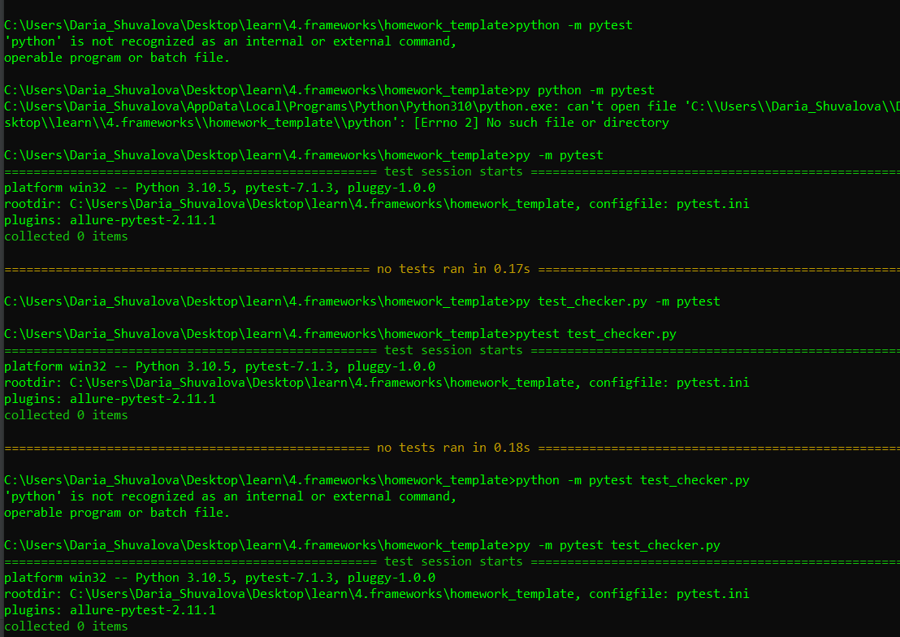
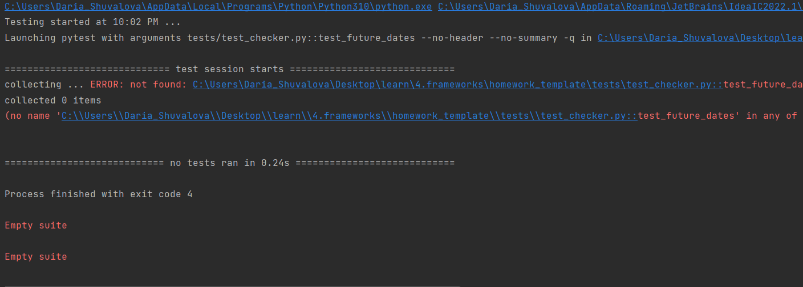

# Test cases:
|      Test name      |Description |                       Source                       | Rule | Expected result |
|:-------------------:|:----------:|:--------------------------------------------------:|:----:|:----------------|
|  test_future_dates  |  checks if employee's hire date is not in the future   | EPGETBIW0395, table hr.employees, field: hire_date |select * from hr.employees where hire > today| 0 rows|
| test_allowed_values |  employee's department is in the range of allowed values (from 1 to 11)   | EPGETBIW0395, table hr.employees, field: department_id |select * from hr.employees where department_id is not in (1, 2, 3, 4, 5, 6, 7, 8, 9, 10, 11)| 0 rows|
|test_country_length|  checks if country's id format is only 2 characters long| EPGETBIW0395, table hr.countries, field: country_id|select * from hr.countries where len(country_id) <> 2| 0 rows|
|  test_postal_codes  |  checks if postal codes are not empty| EPGETBIW0395, table hr.locations, field: postal_code |select * from hr.locations where postal_code is null| 0 rows|
|  test_country_uniqueness  |  checks if countries are unique|EPGETBIW0395, table hr.countries, field: country_name|select country_name, count(*) from hr.countries group by country_name having count(*) > 1| 0 rows|
|  test_min_max_salary  |  checks if minimal employees' salary is actually less than maximum salary|EPGETBIW0395, table hr.jobs, field: min_salary, max_salary|select min_salary, max_salary from hr.jobs where min_salary < max_salary| 0 rows|

# Tests launch:
Open command line, go to the repository location and launch:
python pytest test_checker.py

My launch attempts (tried to launch pytest as module, also renamed directories and files as per naming convention):

